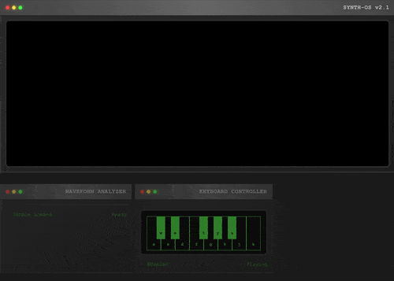
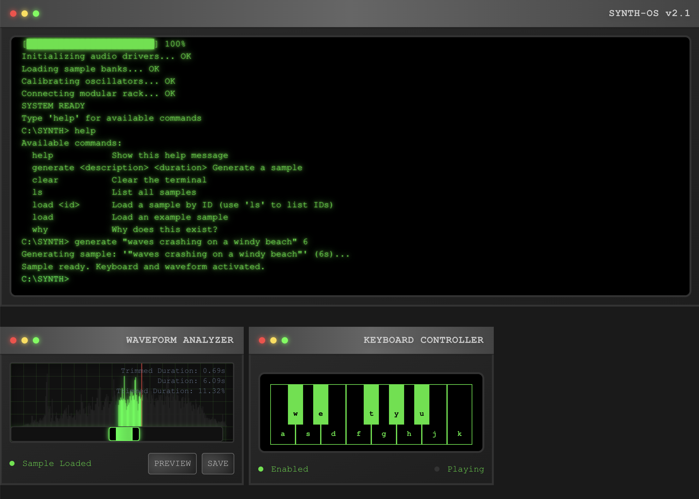

# 11 Labs - AI Audio Sample Generator

A Next.js application that generates and plays AI-powered audio samples through a retro terminal interface. Built with ElevenLabs sound effect generation and featuring a sample library for managing generated audio clips.



## Features

- **Synth OS Terminal**: A retro-style terminal interface for generating AI audio samples
- **Sample Library**: Browse, play, and manage generated audio samples
- **Sample Generation**: Uses ElevenLabs API to create custom audio samples from text descriptions
- **Audio Playback**: Built-in audio player with progress tracking



## Getting Started

First, run the development server:

```bash
npm run dev
# or
yarn dev
# or
pnpm dev
# or
bun dev
```

Open [http://localhost:3000](http://localhost:3000) with your browser to see the result.

You can start editing the page by modifying `app/page.tsx`. The page auto-updates as you edit the file.

## Environment Setup

Make sure to set up your environment variables for ElevenLabs API access and Supabase database connection.
